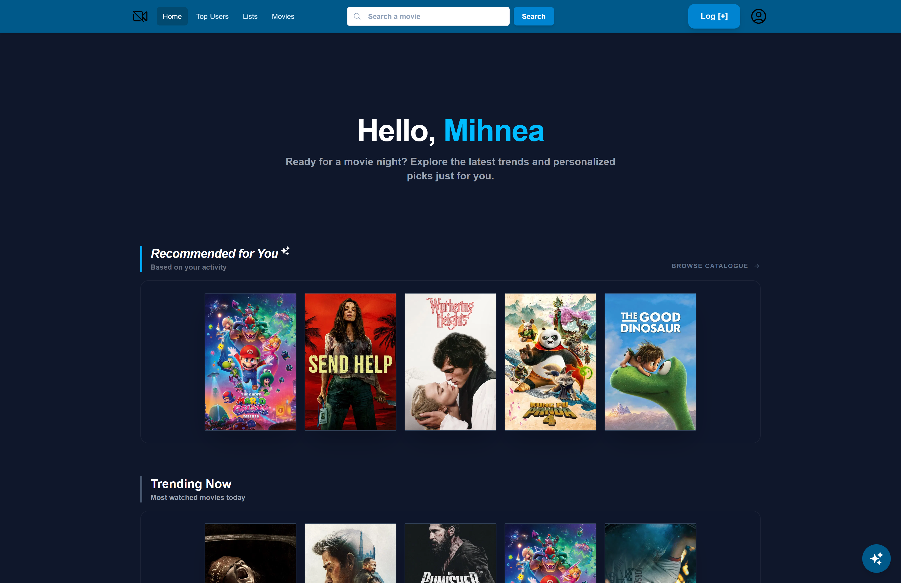
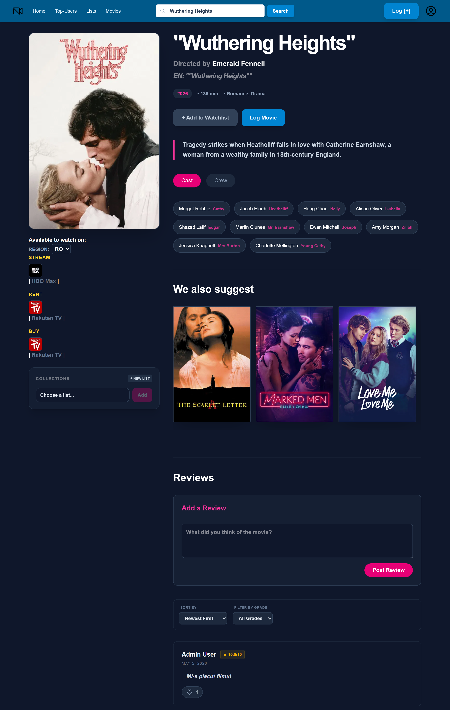
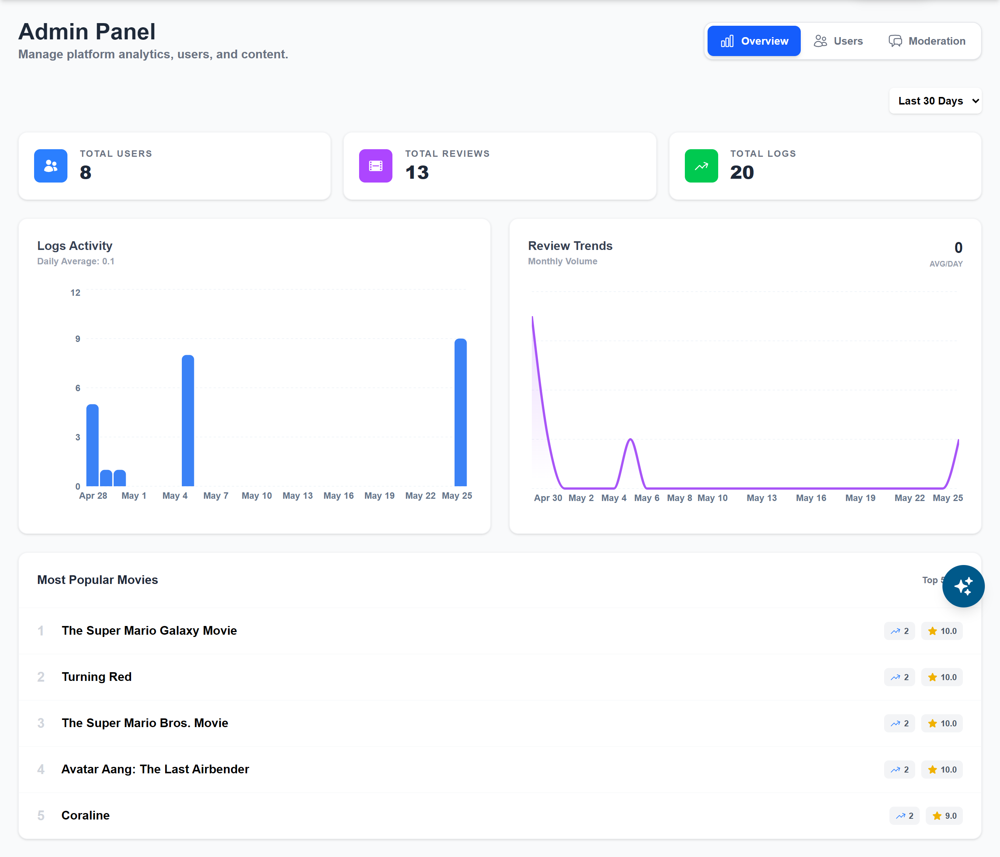

<div align="center">

# 🎬 StreamFinder

### AI-Powered Movie & TV Streaming Discovery Platform

*Stop scrolling. Start watching.*

[](https://www.java.com)
[](https://spring.io/projects/spring-boot)
[](https://www.python.org)
[](https://fastapi.tiangolo.com)
[](https://react.dev)
[](https://www.postgresql.org)
[](#)

</div>

---

## 🎯 The Vision

> **"Where can I stream this movie tonight?"**

This is the ultimate dilemma of the modern streaming era. With digital content scattered across dozens of fragmented platforms, users spend more time scrolling through subscription apps than actually watching movies.

**StreamFinder** is a centralized, AI-driven discovery hub built to solve that exact pain point. By combining rich entertainment metadata from **The Movie Database (TMDB)** with real-time streaming availability data from the **JustWatch API**, the platform lets users search for any movie or TV show and instantly find out where it's available to **stream, rent, or buy** — in their specific geographic region. On top of that, it's a full social layer: personalized recommendations, watchlists, custom lists, reviews, and user profiles.

<p align="center">
  
  <br>
  <em>Fig 1. Homepage — personalized picks, trending titles, and one-click browsing</em>
</p>

---

## 📚 Table of Contents

- [System Architecture](#-system-architecture--microservice-split)
- [Key Features](#-key-features)
- [Tech Stack](#-tech-stack-matrix)
- [Getting Started](#-getting-started)
- [Project Structure](#-project-structure)
- [Contributing](#-contributing)
- [License](#-license)

---

## 🏗️ System Architecture & Microservice Split

To elevate the user experience beyond basic keyword searching, the platform uses a decentralized microservices layout split between **Java** and **Python**, each optimized for what it does best.

### 🟩 1. Spring Boot 4 — Core & GenAI Orchestration

The robust framework powering enterprise logic, secure user data management, and data aggregation pipelines.

- **Generative AI Parsing** — Orchestrates the **Llama 3 70B** LLM through advanced integration pipelines, enabling highly complex natural-language queries such as:
  > *"Find a psychological thriller available on Netflix with a twist like Shutter Island."*
- **Data Integration** — Dynamically fetches and matches payloads from the **TMDB API** (metadata, posters, cast) and the **JustWatch API** (regional availability paths).

### 🟦 2. FastAPI — Hybrid ML Recommendation Engine

A high-performance Python microservice optimized entirely for real-time inference and analytical computation.

- **Hybrid Modeling** — Combines collaborative filtering (user behavior maps) with content-based filtering (genre vector footprints) to generate hyper-personalized watch feeds.
- **Asynchronous Efficiency** — Leverages Python's async ecosystem to deliver recommendation matrices with sub-second latency.

---

## 💡 Key Features

### 🤖 Semantic AI Search — *"Cinema AI"* *(Llama 3 70B)*

A floating conversational assistant lets you skip strict title matching entirely. Describe the mood, vibe, or an obscure plot point, and Cinema AI turns it into concrete recommendations — complete with posters — right inside the chat widget.

<p align="center">
  
  <br>
  <em>Fig 2. Cinema AI — conversational movie discovery, powered by Llama 3 70B</em>
</p>

### 📊 Hybrid Machine Learning Recommendations

The FastAPI service monitors viewing habits and cross-references metadata trends to dynamically recalculate a **"Recommended for You"** feed alongside real-time **"Trending Now"** rankings, updated every time you interact with a title.

*(See Fig 1 above — the homepage surfaces both feeds front and center.)*

### 🎞️ Rich Movie Details & Instant Streaming Availability

Every title gets a full detail page: synopsis, cast & crew, related recommendations, and — most importantly — exactly where to watch it *tonight*. Availability is filtered by region and split into **Stream**, **Rent**, and **Buy**, with direct deep links out to the provider (Netflix, HBO Max, Rakuten TV, and more).

<p align="center">
  
  <br>
  <em>Fig 3. Movie detail page — cast, regional availability, related titles, and user reviews</em>
</p>

### 👥 Social Features — Lists, Reviews & Profiles

Beyond discovery, StreamFinder has a social layer inspired by community film-logging platforms:

- **Custom Lists** — create and manage personal collections, add any title with one click
- **Reviews & Ratings** — rate titles out of 10, leave written reviews, sort by newest or by grade, and like other users' reviews
- **User Profiles & Top-Users** — track what you've logged and see the platform's most active reviewers

*(Visible in Fig 3 — the "Collections," "We also suggest," and "Reviews" sections on every movie page.)*

### 🛡️ Admin Panel & Analytics Dashboard

A dedicated back-office view gives administrators a real-time pulse on the platform: total users, total reviews, total logs, daily logging activity, review-volume trends, and a live "Most Popular Movies" leaderboard — plus dedicated tabs for user management and content moderation.

<p align="center">
  
  <br>
  <em>Fig 4. Admin Panel — platform analytics, activity trends, and moderation tools</em>
</p>

---

## 🛠️ Tech Stack Matrix

| Layer | Technologies |
|---|---|
| **Frontend** | React (Component Lifecycle, Context API), Tailwind CSS (Utility-First Responsive UI) |
| **Backend Frameworks** | Spring Boot 4 (Java 17+ / Jakarta EE), FastAPI (Python 3.10+, Asynchronous Workers) |
| **AI & Machine Learning** | Llama 3 70B Inference Pipeline, Scikit-Learn / Pandas (Hybrid Recommendation Modeling) |
| **Database** | PostgreSQL (Relational metadata tracking, user profile schemas, indexing optimization) |
| **API Ingestion** | TMDB Developer API, JustWatch API Engine |

---

## 🚀 Getting Started

### Prerequisites

- ☕ Java 17 or higher
- 🐍 Python 3.10 or higher
- 🐘 PostgreSQL instance running
- 🔑 TMDB API Key

### Local Installation

1. **Clone the repository**

   ```bash
   git clone https://github.com/rusumihnea23/Web-Platform-for-Searching-Movie-Availability-on-Streaming-Services.git
   cd Web-Platform-for-Searching-Movie-Availability-on-Streaming-Services
   ```

2. **Configure environment variables**

   ```bash
   cp .env.example .env
   # Add your TMDB_API_KEY, JUSTWATCH credentials, and PostgreSQL connection string
   ```

3. **Start the Spring Boot core service**

   ```bash
   cd core-service
   ./mvnw spring-boot:run
   ```

4. **Start the FastAPI recommendation engine**

   ```bash
   cd recommendation-service
   pip install -r requirements.txt
   uvicorn main:app --reload
   ```

5. **Start the React frontend**

   ```bash
   cd frontend
   npm install
   npm run dev
   ```

6. Open **http://localhost:3000** and start discovering. 🎉

---

## 📁 Project Structure

```
Web-Platform-for-Searching-Movie-Availability-on-Streaming-Services/
├── core-service/            # Spring Boot 4 — GenAI orchestration & data aggregation
├── recommendation-service/  # FastAPI — hybrid ML recommendation engine
├── frontend/                # React + Tailwind CSS client
└── README.md
```

---

## 🤝 Contributing

Contributions, issues, and feature requests are welcome!
Feel free to check the [issues page](https://github.com/rusumihnea23/Web-Platform-for-Searching-Movie-Availability-on-Streaming-Services/issues).

---

## 📄 License

This project is licensed under the MIT License.

<div align="center">

⭐ **If you find this project useful, consider giving it a star!** ⭐

</div>